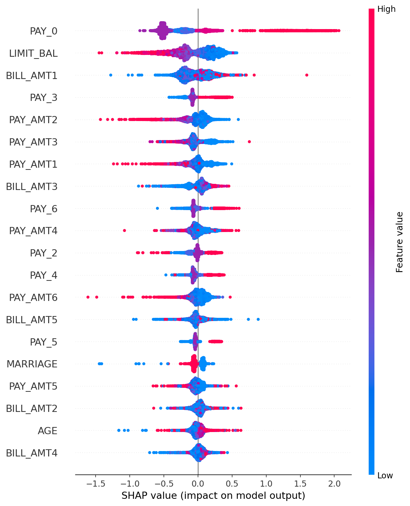

# CreditLens

**Recent payment behavior and payment amounts dominate credit default prediction. Demographics contribute almost nothing.**

CreditLens predicts whether a credit card holder will default on their next payment, with a probability score, a risk rating, and SHAP-based explanations for each prediction. It covers the full ML lifecycle: EDA, training, evaluation, explainability, experiment tracking, and a production scoring API.

**Stack**: Python · CatBoost · XGBoost · LightGBM · SHAP · FastAPI · Docker · Airflow · MLflow · Evidently · uv

Airflow handles scheduled retraining. MLflow tracks experiments. Evidently monitors drift between training data and production scoring requests.

---

## Headline findings

- **Most recent payment status (PAY_0) is the dominant predictor**, with SHAP values ranging from roughly -1 to +2.5. Nothing else comes close.
- **Payment amounts matter more than bill amounts.** Three of the top 7 features are PAY_AMT (how much was paid), and the pattern is consistent: customers paying less are pushed toward default, customers paying more are pushed away. The actual repayment behavior carries more signal than the size of the bill.
- **High credit limits protect against false-positive default predictions.** LIMIT_BAL has a clear inverse relationship in the SHAP plot. The bank's underwriting filter is doing real work.
- **The model has near-zero reliance on demographic features.** AGE and MARRIAGE are at the bottom of the SHAP rankings with narrow value spreads. EDUCATION dropped out of the top 20 entirely after the data cleanup. This is a fairness positive, but low SHAP impact does not guarantee equitable outcomes across groups. Disparate impact analysis should precede any production deployment.

---

## The problem

Missing a default costs more than a false alarm. A bank that flags too many good customers loses business; a bank that misses defaults loses money. CreditLens treats these as unequal errors and optimizes accordingly. Recall on the default class is the primary metric.

---

## Data

- **Source**: UCI Credit Card Default dataset via Kaggle (`uciml/default-of-credit-card-clients-dataset`)
- **Size**: 30,000 records, 23 features
- **Class balance**: 78% non-default, 22% default (3.5:1 ratio)
- **Features**: Credit limit, demographics (age, sex, education, marriage), six months of payment status history, bill amounts, payment amounts
- **Known limitation**: Taiwan credit card holders, 2005. May not generalize to other geographies or current credit behavior.

### Data cleanup

EDA flagged data quality issues in the EDUCATION feature: undocumented categories 0, 5, and 6 were not described in the dataset documentation. These categories were folded into category 4 ("other") to remove noise. The ID column was excluded from training to prevent identifier leakage.

---

## Methods

Three gradient boosting models were trained and compared: **XGBoost, LightGBM, CatBoost.** Each was tuned with `RandomizedSearchCV` optimizing recall, with class imbalance handled via `scale_pos_weight`. All experiments logged to MLflow.

SHAP values were computed for all three models to explain which features drive predictions.

---

## Full results

| Model    | Recall (Class 1) | Precision (Class 1) | F1 (Class 1) | AUC-PR |
| -------- | ---------------- | ------------------- | ------------ | ------ |
| **CatBoost** | **0.621**    | **0.459**           | **0.528**    | **0.551** |
| LightGBM | 0.613            | 0.451               | 0.520        | 0.528  |
| XGBoost  | 0.608            | 0.463               | 0.526        | 0.543  |

CatBoost has the highest recall and the highest AUC-PR and was selected as the production model. The three models are within ~0.013 recall of each other.

### What drives predictions (CatBoost)



- High PAY_0 values (recent delinquency) push predictions toward default
- High LIMIT_BAL (vetted high-limit customers) pushes away from default
- Low payment amounts (PAY_AMT1, PAY_AMT2, PAY_AMT3) push toward default; high payment amounts push away
- Demographic features (age, marriage) contribute very little; EDUCATION dropped out of the top 20 after cleanup

---

## EU AI Act compliance

CreditLens is classified as a high-risk AI system under EU AI Act Annex III, Section 5(b). See `docs/eu_ai_act_compliance.md` for the full mapping against Articles 9, 10, 13, and 14. The compliance framing shaped decisions throughout the project, including feature selection, explainability method, and documentation structure.

---

## Project structure

```
creditlens/
├── dags/          # Airflow DAG for scheduled retraining
├── docs/          # EU AI Act compliance framing, SHAP plots
├── models/        # Saved model artifacts (.pkl)
├── notebooks/     # EDA, training, evaluation
├── scripts/       # MLflow training script
├── src/
│   ├── api/       # FastAPI scoring endpoint
│   ├── data/      # Data loading utilities
│   └── models/    # Training, evaluation, SHAP
├── Dockerfile
└── pyproject.toml
```

---

## How to run

**Setup**

```bash
git clone https://github.com/mychellehale/creditlens.git
cd creditlens
uv sync  # install all dependencies
```

**Train models and log to MLflow**

```bash
python -m scripts.train_all_mlflow  # run from repo root after uv sync
mlflow ui                           # view results at http://127.0.0.1:5000
```

**Start the scoring API**

```bash
uvicorn src.api:app --reload  # run from repo root
# interactive docs at http://127.0.0.1:8000/docs
```

**Run with Docker**

```bash
docker build -t creditlens .
docker run -p 8000:8000 creditlens
```

---

## Future work

- **Disparate impact analysis** across age, sex, education, and marriage to confirm fairness in outcomes across groups. Low SHAP impact on demographic features does not guarantee equitable outcomes. This analysis should precede any production deployment. EU AI Act Article 10 framing.
- **Threshold tuning**: 0.5 may not be optimal for a recall-focused deployment. A threshold sweep with precision-recall tradeoff visualization is the next step.
- **Expanded compliance documentation** for production use under the EU AI Act.